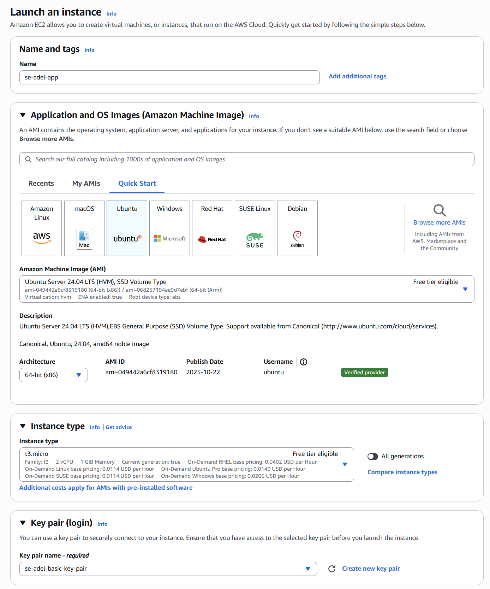
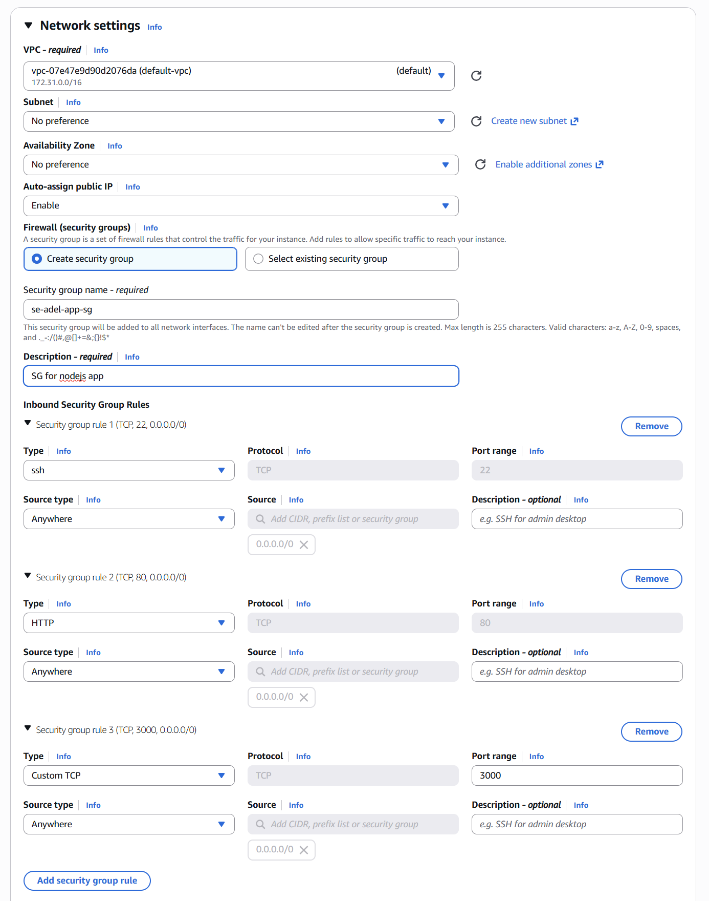

## 1. Create a new EC2 instance on AWS

You can use prior kep.pem || create new, and place in to your .ssh folder

Important: Create a new security group as the app will be hosted on port 3000

1. Type:ssh, Port: 22, 0.0.0.0/0
2. Type:http, Port: 80 Source_type:Anywhere, 0.0.0.0/0
3. Type:Custom TPC, Port:3000, 0.0.0.0/0

launch the instance and connect to it.





## 2. Navigate to your local .shh and place the key.pem there

## 3. Set up the application in ubuntu
Open a new bash terminal and transfer the .zip to EC2
Run this command from your LOCAL machine
    
scp -i /path/to/your/keypair.pem "filename.zip" <ec2-user>@<EC2-PUBLIC-IP-ADDRESS>:/path/on/ec2/destination/

* If You are the directory of the .zip file --> Adel@LAPTOP-SK84CJGV MINGW64 /d/Developer/SpartaDevops
Use the following:

```$ scp -i /c/Users/Adel/.ssh/se-adel-basic-key-pair.pem "2-nodejs20-se-test-app-2025.zip" ubuntu@ec2-3-254-151-16.eu-west-1.compute.amazonaws.com:~```

Confirmation respond
```2-nodejs20-se-test-app-2025.zip  100%   33KB 593.2KB/s   00:00```

## 4. Install dependencies 

App deployment manual steps:

1. ```sudo apt update -y```
2. ```sudo apt upgrade -y```

Install unzip & Unzip:
3. ```sudo apt install unzip -y```
4. ```sudo unzip 2-nodejs20-se-test-app-2025.zip```

Install and run nginx
5. ```sudo apt install nginx -y```
To check the nginx run
6. ```sudo systemctl status nginx```
    `q` to return to normal terminal

Install necessary dependencies for NodeSource setup
Spec version of node20, this is just download the file in AWS EC2
7. ```sudo bash -c "curl -fsSL https://deb.nodesource.com/setup_20.x | bash -"```

Returned message:
14 packages can be upgraded. Run 'apt list --upgradable' to see them.
2025-11-18 16:10:51 - Repository configured successfully.
2025-11-18 16:10:51 - To install Node.js, run: apt install nodejs -y
2025-11-18 16:10:51 - You can use N|solid Runtime as a node.js alternative
2025-11-18 16:10:51 - To install N|solid Runtime, run: apt install nsolid -y

Install nodejs 20 and check version
8. ```sudo apt install nodejs -y```
9. ```node -v```

Go into the folder we unzipped, then into the app folder
10. ```cd nodejs20-se-test-app-2025/app```

Install npm libary there to run the app properly
11. ```sudo npm install```

## 5. Start the app.js

12. ```npm start app.js```

Check your IP address to see the application to run.
Port 3000 --> eg. http://<public EC2 IP>:3000
http://3.254.151.16:3000

Press Ctrl+C to stop it.


