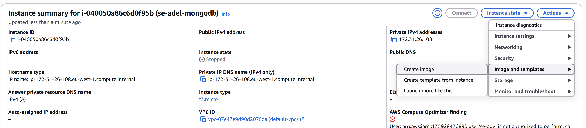
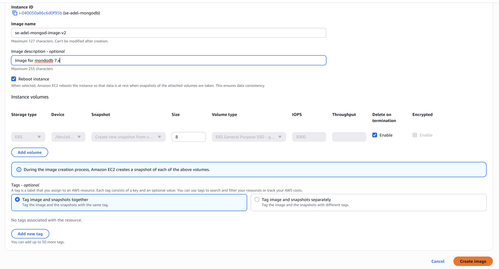
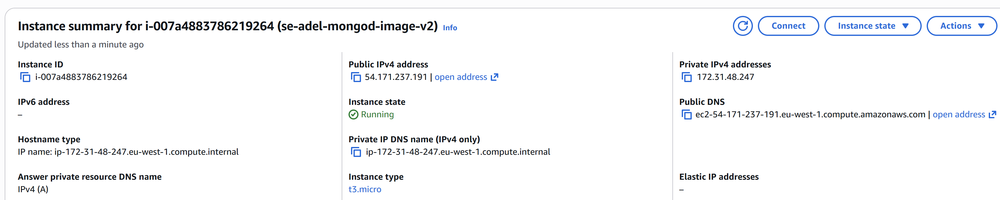

# Deploy MongoDB by Image

It makes the deployment, reboot faster than the script verion
IMPORTANT: If you already run MongoDB EC2 instance one, include the following `sudo systemctl enable mongod` to be able to restart it.

### Continue from previous README.md

You have a running APP that connected to a deployed MongoDB
Test: http://<'Your public IP Address of App EC2'>/posts

IF OK --> Stop your Mongo EC2 instance, and follow the instruction on below images

Do not need to connect to Just copy the Public IP from MongoDb Image Instance, 
and place it to the App .bashrc script, as prior

`DB_HOST=mongodb://EC2-DB-IMAGE-IP-PUBLIC-ADDRESS:27017/posts`

Then restart the App, as usual:

`cd nodejs20-se-test-app-2025/app`

to be sure it stoped before restart
`pm2 kill`

no need `sudo npm install` if you already run the the app once

`node seeds/seed.js`

`pm2 start app.js`