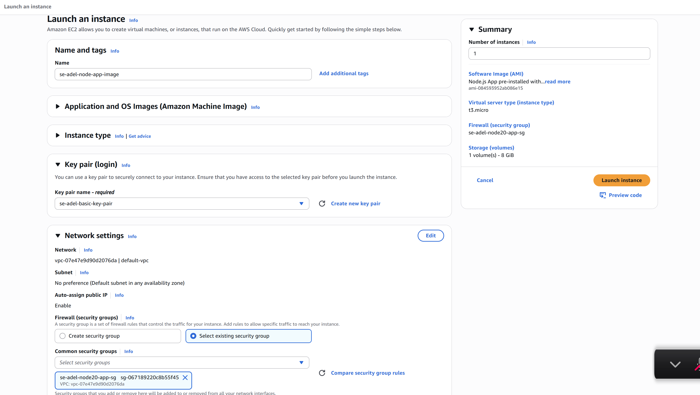
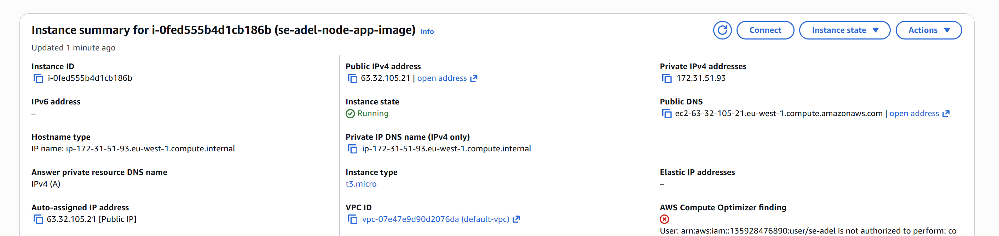

# Create App Image

If you use prior App EC2, then remove or comment out the DB_HOST line from .bashrc file.

Stop the EC2 Instance.

### Connect and Configure the Database Host
The new App instance is running, but it doesn't know the IP address of your working MongoDB instance.

Get the Public IP of the new App instance.

Get the Public IP of your working MongoDB instance.

SSH into the new App EC2 instance:
`ssh -i "<your-key-pair.pem>" ubuntu@<New_App_Public_IP>`

ssh -i "se-adel-basic-key-pair.pem" ubuntu@ec2-63-32-105-21.eu-west-1.compute.amazonaws.com

##### Set the DB_HOST environment variable:

Use the Public IP of your MongoDB IMAGE EC2 server:

Open the .bashrc file
`sudo nano ~/.bashrc`

Add the connection string to the end of the file:
`export DB_HOST=mongodb://<MONGODB_PUBLIC_IP_ADDRESS>:27017/posts`

Save and close the file, then apply the changes
`source .bashrc`

Verify the variable is set
`printenv DB_HOST`

Go to App
`cd nodejs20-se-test-app-2025/app`
`sudo npm install -g pm2`
`node seeds/seed.js`
`pm2 start app.js --name sparta-app`

Test The App and Connection to MongoDB

--------------------------------------------

Additional:
To check status: `pm2 status`

Generate a startup script for pm2
`pm2 startup`

`sudo env PATH=$PATH:/usr/bin /usr/lib/node_modules/pm2/bin/pm2 startup systemd -u ubuntu --hp /home/ubuntu`

This command will output a specific sudo command tailored to your Ubuntu system. Copy and run the command.

To save the Process List:

Tell PM2 to remember and launch the currently running application(s) on every future boot

`pm2 save`
