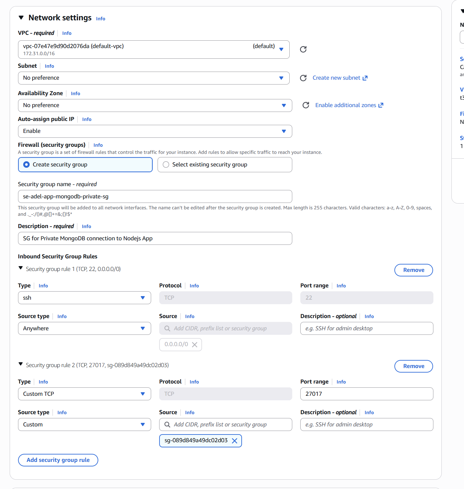
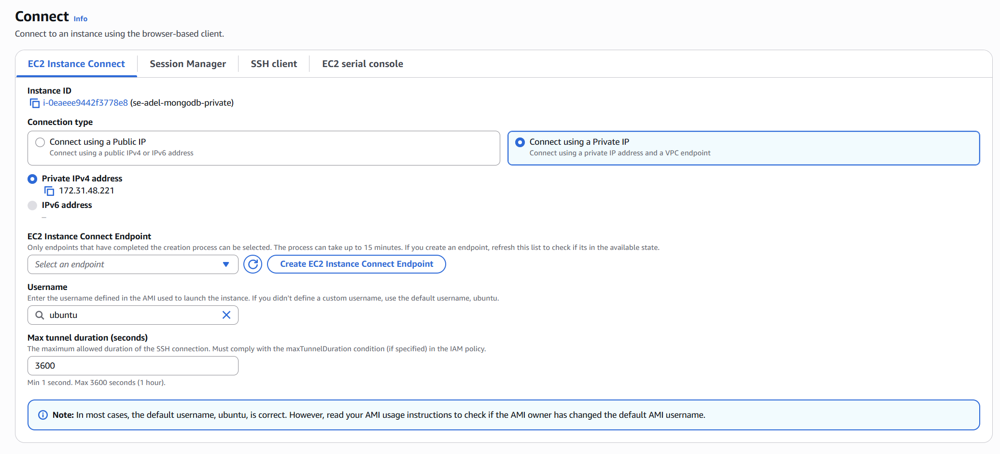

### 1. Create App EC2 Instance

### 2. Create MongoDB EC2 Instance

With The Security Group ID of App Ec2

Click Connect and Pick the Private IP 

Then Connect and Run the *deploy_mongodb.sh* script in bash

to test MongoDB run `sudo systemctl status mongod` then `q`

### 3. Deploy App

Connect to App (PublicIP) and Run the *deploy_app.sh* script with the MongoDB Private IP Address in it.

Test Connection: http://"<Your App Public IP>"/posts

### 4. Create AMI (image) from previous MongoDB EC2

Copy out the Private IP Address and Place in the *deploy_app.sh*, and deploy again the App EC2
Test connection

### 5. Create AMI (image) from previous App EC2

