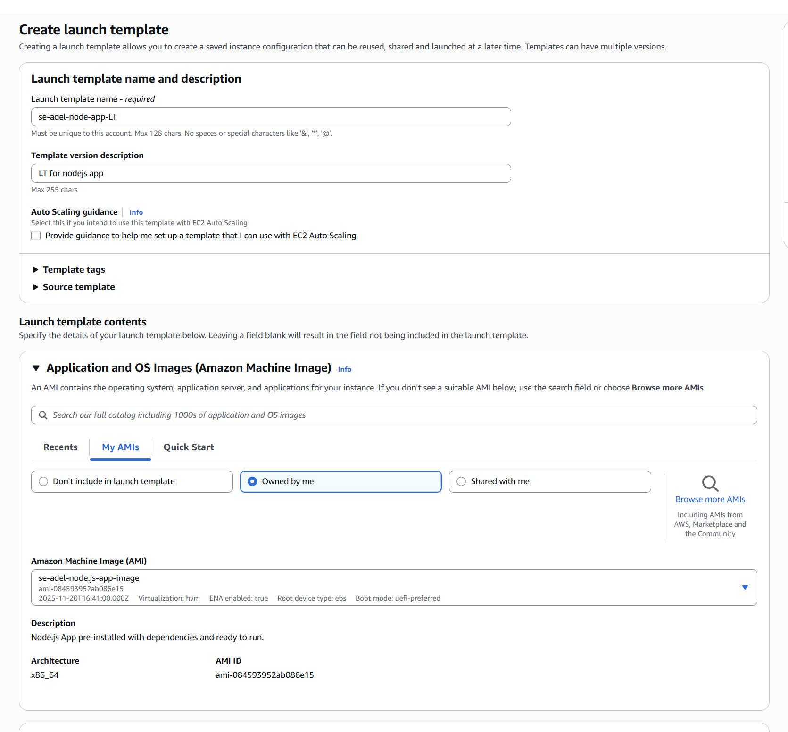
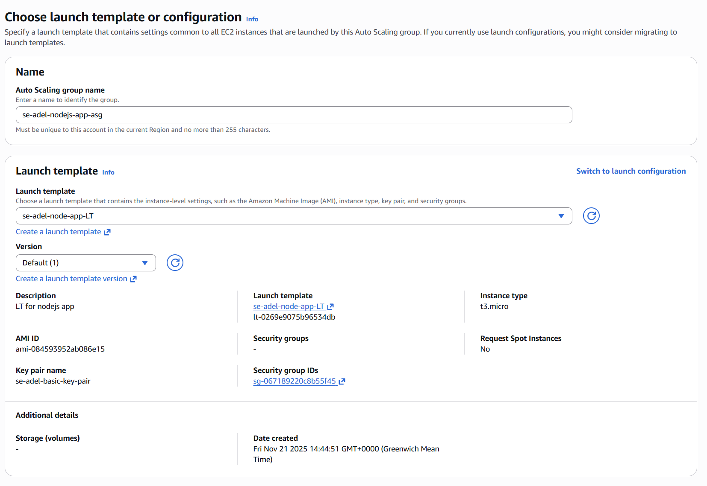
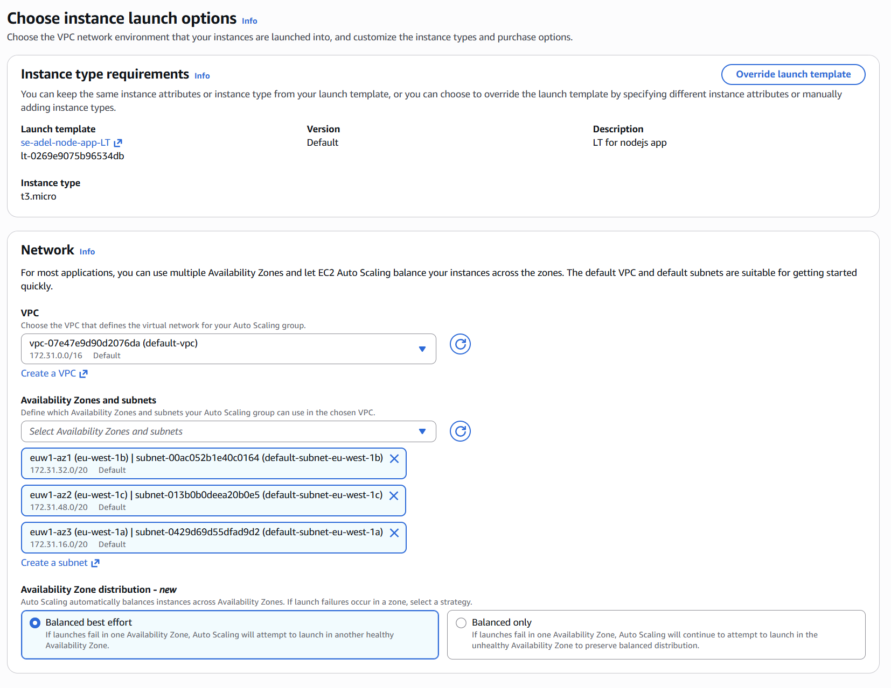
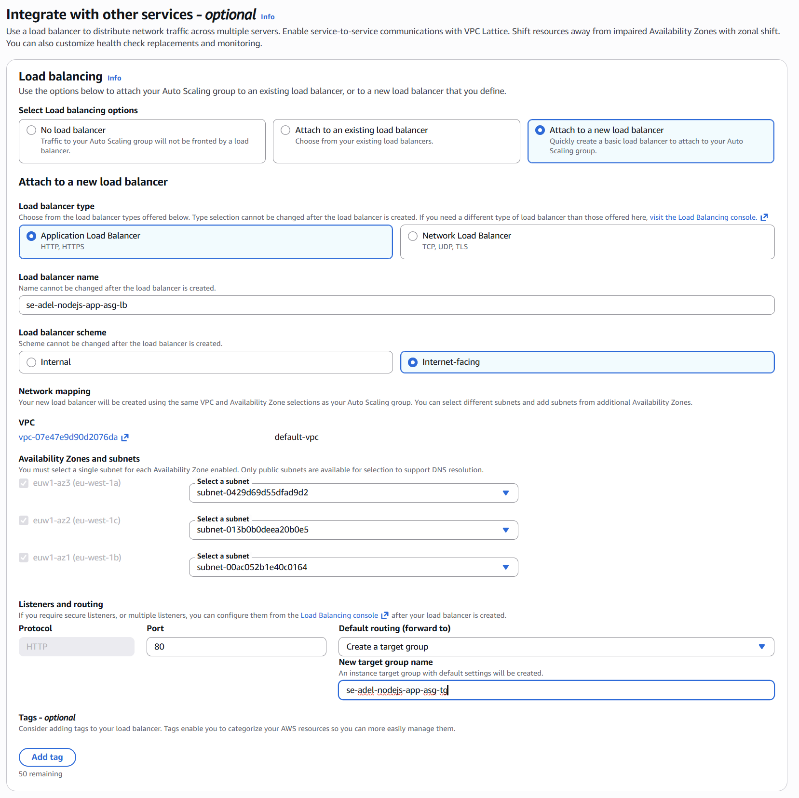
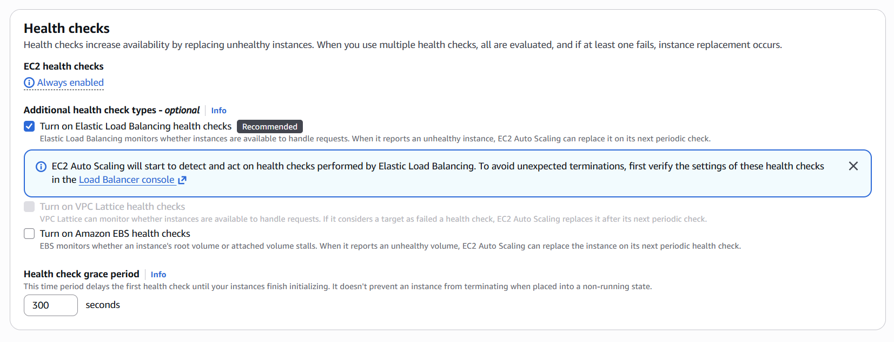
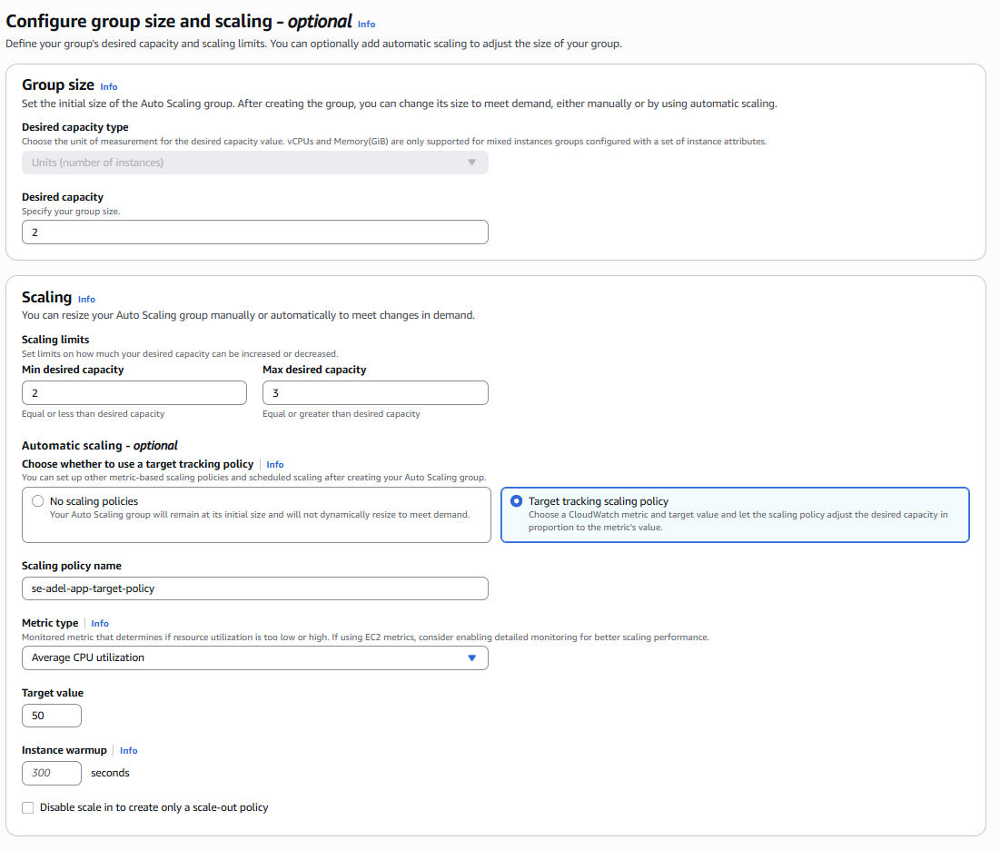

# 1. Create EC2 Instance *Lanch Template*

Use the already existing/deployed Node App EC2 IMAGE

Go to EC2 Lanch Template and create a template:
    * add AMI (aws machine image) and assign it to the App Image
    * pick the same instance type as App Image
    * assign it to the same Security Group as the App Image
    * assign it to the same Key Pair as the App Image
    * IMPORTANT: add the auto_AMI_script.sh code to the *Advanced section's USER DATA* option 

# 2. Create EC2 *AUTO SCALING GROUP*

Use the recently created App Lanch Template Instance to it

### Go to EC2 Auto Scaling Group and create or launch the configuration

* Name it: se-name-app-asg
* Select launch template: select the one you created above
    Pick the same instance type etc
    (if you only have an AMI, you will need to create a Launch template first using the AMI)

* in the Network section:
        VPC: leave as the default-vpc
        Availability zones and subnets: put a check mark next to the 3 different availability zones

* in the Load balancing section:
    Select Attach to a new load balancer
    in the Attach to a new load balancer section:
        Load balancer type: select Application Load Balancer
        Load balancer name: give it an appropriate name e.g. se-name-app-asg-lb
        Load balancer scheme: select Internet-facing
            in Listeners and routing --> New target group name: add tg (tg=target group) like se-name-app-asg-lb-tg

* in Health checks section:
        Tick Turn on Elastic Load Balancing health checks
        Health check grace period: leave it as 300 seconds

* on screen 4 Configure group size and scaling policies:
    In Group size - optional section:
        Desired capacity: change to 2  
        Minimum capacity: change to 2
        Maximum capacity: change to 3
    In Scaling policies - optional section --> Select option Target tracking scaling policy

* on last screen Add tags --> Click Add tag button:
        Key: Name
        Value: se-name-app-asg
        Important! If you don't add this tag, the instances created by the ASG will not be named!
    At the bottom, click the Next button

### Check your Auto Scaling Group is working
    Access the app via the Load Balancer:
       Go to Load Balancers
       Filter for your load balancer --> Click on it to go to its Details
       Copy the DNS name and paste it into a browser tab
       Check the app frontpage works (and posts page if connected to database)

    
    When you manually terminate a Virtual Machine (VM) that was created by an Auto Scaling Group (ASG), the ASG will automatically detect the reduction in the number of running instances and try to restore the group to its desired capacity.

    After the manual termination, if you refresh the page: A new VM is launched. The Auto Scaling Group initiates the process of launching a replacement VM using the group's configured Launch Template or Launch Configuration.
    Once the new VM is successfully running and passes its health checks, the ASG's current capacity will match the desired capacity again.

### Delete the Auto Scaling Group to stop those VMs from being created.
       Delete the load balancer
       Delete the target group 
       Delete the ASG